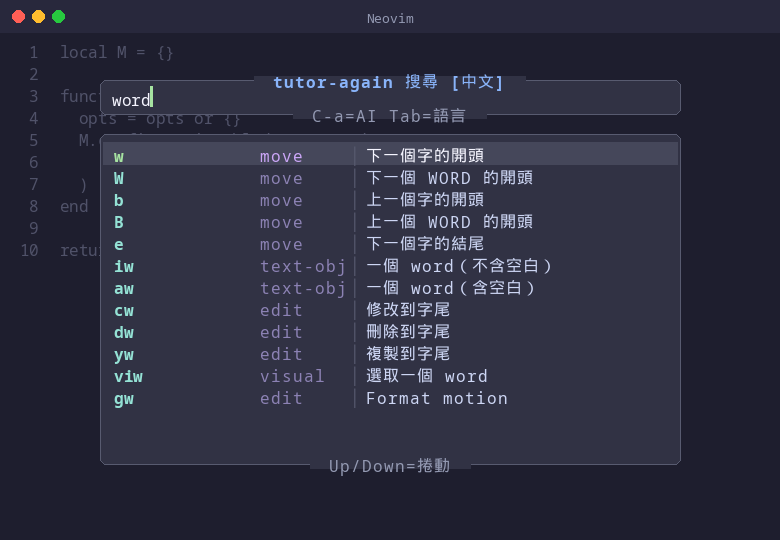
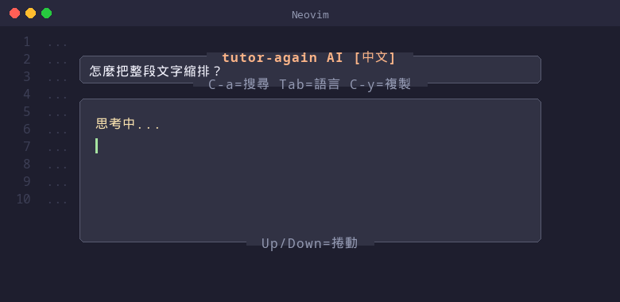
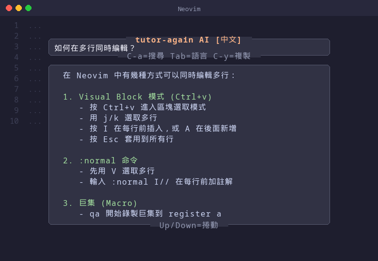
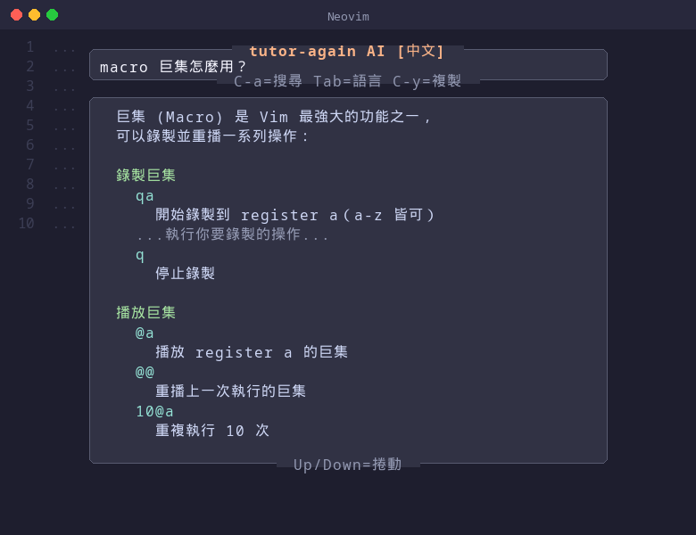
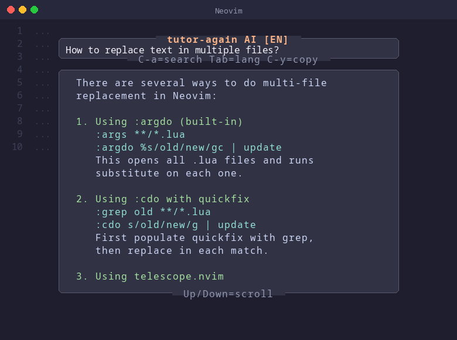
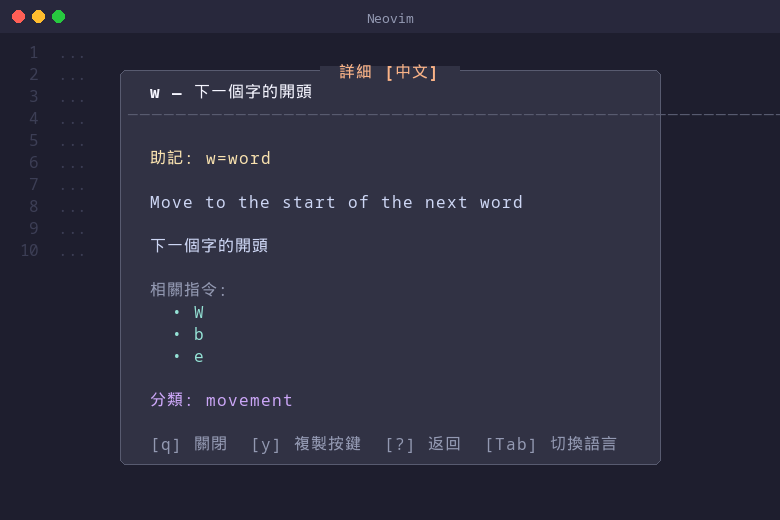
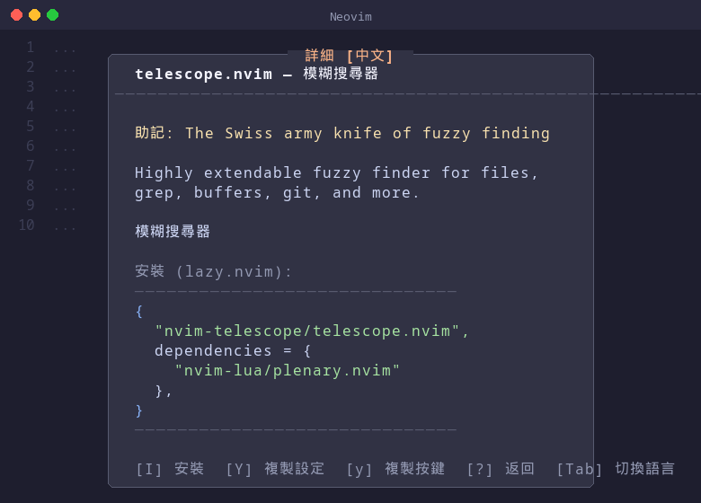
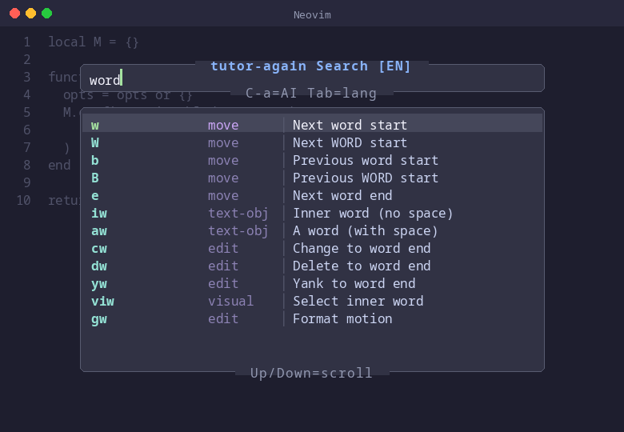
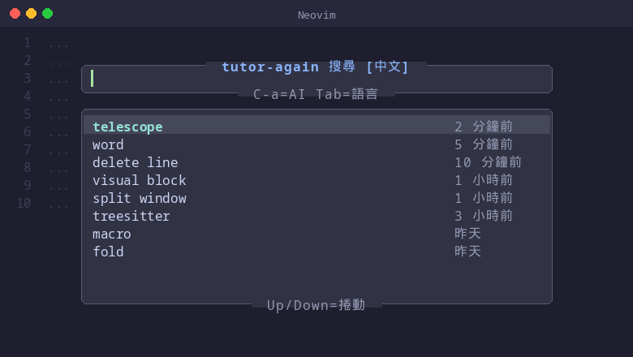

# tutor-again.nvim

Interactive Vim/Neovim learning plugin. Fuzzy search 276 commands instantly, or ask an AI tutor — all inside a floating window.

Supports bilingual display (English / 繁體中文) with one-key toggle.

## Screenshots

### Fuzzy Search — instantly filter 276 commands



Type any keyword and results appear instantly. Each entry shows key sequence, category, and a bilingual description.

### AI Tutor — ask Vim questions in natural language

Press `<C-a>` to switch to AI mode. Type a question, press `<CR>`, and get a streaming AI response.

**Asking a question — "思考中..." loading state:**



**Streaming response (中文) — multi-line editing tutorial:**



**Streaming response (中文) — macro usage guide:**



**Streaming response (English) — multi-file replace:**



AI responses are formatted with numbered steps, code examples highlighted in color, and scrollable via `<Up>`/`<Down>`. Press `<C-y>` to copy the full response to clipboard.

### Detail View — mnemonic, description, related commands



Press `<CR>` on any result to see a full detail card: mnemonic hint, English/中文 descriptions, related commands, and category.

### Plugin Detail — one-key install with lazy.nvim



Plugin entries include install config. Press `I` to write the config file and trigger `:Lazy sync` automatically.

### Bilingual Toggle — `<Tab>` to switch language

| 中文 mode | English mode |
|---|---|
|  |  |

### Search History — persistent across sessions



When the input is empty, previous searches are shown with relative timestamps. Select a history entry to re-run it.

## Features

- **Fuzzy Search** — 276 Vim/Neovim commands across 9 categories (movement, operators, text objects, insert, visual, search, files, settings, plugins)
- **Bilingual** — English and 繁體中文 names, descriptions, and tags; `<Tab>` to toggle language
- **AI Tutor** — Ask Vim questions in natural language with streaming AI responses (powered by Gemini / OpenRouter)
- **Detail View** — Mnemonic hints, descriptions, related commands, and one-key plugin install
- **Search History** — Persistent history with deduplication
- **Plugin Install** — One-key install for plugin entries (lazy.nvim integration)

## Requirements

- Neovim >= 0.9
- `curl` (for AI mode)
- API key for AI mode (Gemini API or OpenRouter)

## Installation

### lazy.nvim

```lua
{
  "jacktse/tutor-again.nvim",
  opts = {},
  keys = { { "<leader>?", desc = "tutor-again: open" } },
}
```

### Manual / Other Plugin Managers

Clone to your Neovim packages directory:

```bash
git clone https://github.com/jacktse/tutor-again.nvim \
  ~/.local/share/nvim/site/pack/plugins/start/tutor-again.nvim
```

Then add to your `init.lua`:

```lua
require("tutor-again").setup({})
```

## Configuration

```lua
require("tutor-again").setup({
  keymap = "<leader>?",   -- keybind to open (set "" to disable)
  lang = "zh-TW",         -- default language: "zh-TW" or "en"
  history = {
    max_entries = 500,     -- max search history entries
  },
  ai = {
    enabled = true,
    api_key = nil,         -- or set env: GEMINI_API_KEY / OPENROUTER_API_KEY
    base_url = "https://generativelanguage.googleapis.com/v1beta/openai",
    model = "gemini-2.5-flash-lite",   -- string or list for fallback
    mode_key = "<C-a>",   -- key to toggle search/AI mode
  },
})
```

### AI Setup

1. Get a free API key from [Google AI Studio](https://aistudio.google.com/apikey)
2. Set the environment variable:

```bash
# bash/zsh
export GEMINI_API_KEY="your-key-here"

# fish
set -Ux GEMINI_API_KEY "your-key-here"
```

Or use [OpenRouter](https://openrouter.ai/) (has free models):

```bash
export OPENROUTER_API_KEY="your-key-here"
```

With OpenRouter, update config:

```lua
ai = {
  base_url = "https://openrouter.ai/api/v1",
  model = { "google/gemma-3-4b-it:free", "deepseek/deepseek-r1:free" },
}
```

## Usage

### Commands

| Command | Action |
|---|---|
| `:TutorAgain` | Open search window |
| `:TutorAgain ai` | Open in AI mode |
| `:TutorAgain history` | Open with history |

### Search Mode

| Key | Action |
|---|---|
| Type text | Live fuzzy search |
| `<Up>` / `<Down>` | Navigate results |
| `<CR>` | Open detail view |
| `<Tab>` | Toggle language (中文/EN) |
| `<C-a>` | Switch to AI mode |
| `<Esc>` | Close |

### AI Mode

| Key | Action |
|---|---|
| Type question | Enter your Vim question |
| `<CR>` | Send question |
| `<Up>` / `<Down>` | Scroll AI response |
| `<C-y>` | Copy response to clipboard |
| `<Tab>` | Toggle language |
| `<C-a>` | Switch to Search mode |
| `<Esc>` | Close |

### Detail View

| Key | Action |
|---|---|
| `q` / `<Esc>` | Close |
| `y` | Copy key sequence to clipboard |
| `Y` | Copy install config (plugins only) |
| `I` | One-key install (plugins only) |
| `?` | Back to search |
| `<Tab>` | Toggle language |

## Command Database

276 entries across 9 categories:

| Category | Examples |
|---|---|
| **movement** | `h` `j` `k` `l` `w` `b` `gg` `G` `Ctrl+d` `Ctrl+u` `%` |
| **operators** | `d` `c` `y` `p` `>` `<` `=` `gU` `gu` `~` |
| **text_objects** | `iw` `aw` `i(` `a{` `it` `at` `is` `as` |
| **insert** | `i` `a` `o` `O` `A` `I` `gi` `Ctrl+r` |
| **visual** | `v` `V` `Ctrl+v` `gv` `o` |
| **search** | `/` `?` `*` `#` `n` `N` `:s` `:%s` |
| **files** | `:w` `:q` `:e` `:bn` `:bp` `Ctrl+w` splits |
| **settings** | `set number` `set relativenumber` `set tabstop` ... |
| **plugins** | telescope.nvim, nvim-treesitter, nvim-lspconfig, lazy.nvim ... |

## Usage Patterns

### Pattern 1: Quick Command Lookup

The most common workflow — you know roughly what you want but can't remember the exact key.

```
<leader>?  →  type "delete"  →  see dd, D, x, dw, dap...  →  <CR> for details  →  y to copy
```

### Pattern 2: Learning by Category

Browse commands by typing a category name to explore related commands you might not know.

```
<leader>?  →  type "text obj"  →  discover iw, aw, i(, a{, it...  →  <CR> to learn each one
```

### Pattern 3: AI-Assisted Learning

When you have a "how do I..." question that doesn't map to a single command.

```
<leader>?  →  <C-a> (switch to AI)  →  "如何在多行同時編輯？"  →  <CR>  →  read streaming answer
```

### Pattern 4: Plugin Discovery & Install

Find and install popular Neovim plugins without leaving your editor.

```
<leader>?  →  type "telescope"  →  <CR> for detail  →  I to one-key install  →  restart nvim
```

### Pattern 5: Bilingual Reference

Share the same tool between English and Chinese speakers. Toggle with a single key.

```
<leader>?  →  type "word"  →  see results in 中文  →  <Tab> to switch to English  →  <Tab> back
```

## Development

### Run Tests

```bash
# All tests (64 cases)
make test

# Unit tests only
make test-unit

# Integration tests only
make test-integration
```

### Manual Testing

```bash
make dev
```

### Project Structure

```
lua/tutor-again/
  init.lua        -- setup, commands, keymaps
  config.lua      -- default config and merging
  ui.lua          -- floating window UI, search/AI modes
  ai.lua          -- AI API client, system prompt, SSE parser
  search.lua      -- fuzzy scoring and filtering
  history.lua     -- persistent search history
  db/
    init.lua      -- lazy-loads all db modules
    movement.lua  -- movement commands
    operators.lua -- operator commands
    ...           -- 9 category modules
plugin/
  tutor-again.lua -- thin loader shim
tests/
  test_ai.lua          -- AI module: prompt, SSE parser, wrap, api key
  test_config.lua      -- Config defaults and merging
  test_db.lua          -- Database integrity and i18n
  test_search.lua      -- Fuzzy scoring and filtering
  test_history.lua     -- History persistence
  test_integration.lua -- End-to-end with child Neovim
scripts/
  minimal_init.lua     -- Test runner setup
```

## Publishing to GitHub

### 1. Create Repository

```bash
cd /path/to/vim-tutor
git remote add origin git@github.com:jacktse/tutor-again.nvim.git
git push -u origin main
```

### 2. Create a Release Tag

```bash
git tag v1.0.0
git push origin v1.0.0
```

### 3. Users Install via lazy.nvim

```lua
{ "jacktse/tutor-again.nvim", opts = {} }
```

No build step needed — Neovim plugin managers clone the repo and add it to `runtimepath`. The directory structure (`lua/`, `plugin/`) is already the standard Neovim plugin layout.

### Tips for Publishing

- The repo name should match the plugin name (e.g., `tutor-again.nvim`)
- Add topics on GitHub: `neovim`, `neovim-plugin`, `vim`, `lua`
- Use [GitHub Releases](https://docs.github.com/en/repositories/releasing-projects-on-github) for versioning
- Add a `LICENSE` file (MIT recommended)

## License

MIT
